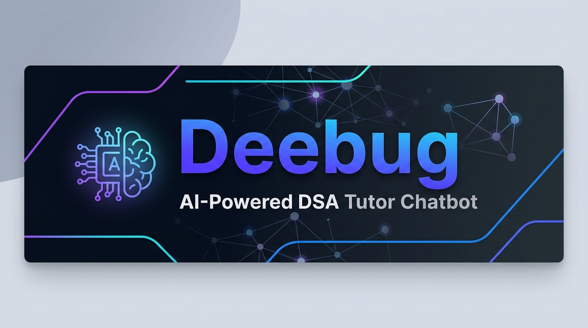

<div align="center">
  
  
  <br/>

  <p>
    
    
    
    
    
    
  </p>

  <p>
    <strong>An intelligent DSA tutoring system that teaches through guided discovery — never by revealing solutions.</strong>
  </p>

  <p>
    <a href="#-features">Features</a> •
    <a href="#-architecture">Architecture</a> •
    <a href="#-tech-stack">Tech Stack</a> •
    <a href="#-quick-start">Quick Start</a> •
    <a href="#-api-reference">API Reference</a> •
    <a href="#-project-structure">Project Structure</a>
  </p>
</div>

---

## 🎯 What is Deebug?

**Deebug** is a full-stack AI chatbot that acts as your personal DSA (Data Structures & Algorithms) tutor. Unlike a simple code generator, Deebug is engineered to **teach, not cheat** — it uses a multi-stage AI pipeline to provide Socratic-style guidance, hints, and conceptual explanations without ever writing code for you.

> 💡 **Philosophy**: The best way to master DSA is to struggle productively. Deebug keeps you in that sweet spot — challenged but never lost.

**Key highlights:**
- 🧠 **LangGraph-powered AI pipeline** with 11 interconnected nodes
- 🛡️ **5-layer safety system** that actively prevents code leakage
- ⚡ **Real-time SSE token streaming** for a natural, typing-effect response
- 📊 **LeetCode problem bank** with semantic search via FAISS vector embeddings
- 🗂️ **Persistent chat history** with session management (SQLite + Prisma)
- 🎨 **Monaco Code Editor** integration for users to share their code attempts

---

## ✨ Features

| Feature | Description |
|---|---|
| 🤖 **Smart Intent Classifier** | Detects if you're asking for a concept, hint, code review, debugging help, or trying to extract a solution |
| 🚫 **Anti-Cheat Engine** | 5-layer pipeline ensuring the AI never gives away answers directly |
| 💬 **Streaming Responses** | Answers stream token-by-token via Server-Sent Events for a fluid UX |
| 🔍 **RAG Context Injection** | Retrieves relevant DSA concepts from a FAISS vector store to enrich answers |
| 📝 **Session Persistence** | All conversations are saved per-problem, per-user in SQLite |
| ⭐ **Feedback System** | Users can rate responses to improve quality over time |
| 🖥️ **Integrated Code Editor** | Monaco Editor embedded in the UI — paste your attempt and get a review |
| 📂 **Problem Library** | 3000+ LeetCode problems seeded from CSV, searchable by difficulty & tags |

---

## 🏗️ Architecture

```
                        ┌─────────────────────────────────────────────────┐
                        │              User (Browser)                     │
                        │          Next.js 14 Frontend                    │
                        └────────────────────┬────────────────────────────┘
                                             │ SSE Stream
                        ┌────────────────────▼────────────────────────────┐
                        │           Express.js REST API                   │
                        │        (Node.js + TypeScript)                   │
                        └────────────────────┬────────────────────────────┘
                                             │
                        ┌────────────────────▼────────────────────────────┐
                        │          LangGraph Tutor Pipeline               │
                        │                                                 │
                        │  ┌─────────────────────────────────────────┐   │
                        │  │         Intent Classifier               │   │
                        │  │  (concept / hint / debug / rejected /   │   │
                        │  │       off_topic / code_review)          │   │
                        │  └──────┬──────────────┬───────────────────┘   │
                        │         │              │                        │
                        │  ┌──────▼──────┐  ┌───▼────────┐              │
                        │  │  Off-Topic  │  │ Rejection  │              │
                        │  │    Node     │  │   Setup    │              │
                        │  └──────┬──────┘  └───┬────────┘              │
                        │         │              │                        │
                        │         │        ┌─────▼────────────┐          │
                        │         │        │ Context Injector │          │
                        │         │        │   (FAISS RAG)    │          │
                        │         │        └─────┬────────────┘          │
                        │         │              │                        │
                        │         │        ┌─────▼────────────┐          │
                        │         │        │  Prompt Builder  │          │
                        │         │        └─────┬────────────┘          │
                        │         │              │                        │
                        │         │        ┌─────▼────────────┐          │
                        │         │        │   Teacher LLM    │          │
                        │         │        │  (Groq / Gemini) │          │
                        │         │        └─────┬────────────┘          │
                        │         │              │                        │
                        │         │   ┌──────────▼──────────────────┐   │
                        │         │   │      5-Layer Safety System   │   │
                        │         │   │  1. Intent block (input)     │   │
                        │         │   │  2. System prompt rules      │   │
                        │         │   │  3. Regex (50+ patterns)     │   │
                        │         │   │  4. Heuristic analysis       │   │
                        │         │   │  5. Judge LLM (AI reviewer)  │   │
                        │         │   └──────────┬──────────────────┘   │
                        │         │              │                        │
                        │         │        ┌─────▼────────────┐          │
                        │         │        │Response Formatter│          │
                        │         │        └─────┬────────────┘          │
                        │         │              │                        │
                        │  ───────┴──────────────┘                       │
                        └─────────────────┬───────────────────────────── ┘
                                          │ Token stream
                                 ┌────────▼────────┐
                                 │   SQLite (via   │
                                 │   Prisma ORM)   │
                                 └─────────────────┘
```

### 🛡️ 5-Layer Safety System

The crown jewel of Deebug is its multi-stage, defense-in-depth approach to preventing solution leakage:

| Layer | Mechanism | Stage |
|---|---|---|
| **1. Intent Classification** | LLM-based intent detection blocks `REJECTED` requests before any response is generated | Input |
| **2. System Prompt Rules** | Strict LLM instructions embedded in every request prohibiting code output | Prompt |
| **3. Regex Detection** | 50+ patterns detecting code syntax across 10+ programming languages | Output |
| **4. Heuristic Analysis** | Structural analysis — semicolon density, indentation ratios, brace matching, arrow functions | Output |
| **5. Judge LLM** | Independent secondary AI reviewer audits the Teacher LLM's response | Output |

---

## 🛠️ Tech Stack

<table>
  <thead>
    <tr>
      <th>Layer</th>
      <th>Technology</th>
      <th>Purpose</th>
    </tr>
  </thead>
  <tbody>
    <tr>
      <td><strong>Frontend</strong></td>
      <td>Next.js 14, TypeScript, TailwindCSS</td>
      <td>App Router, SSE streaming UI, Monaco Editor</td>
    </tr>
    <tr>
      <td><strong>Backend</strong></td>
      <td>Node.js, Express.js, TypeScript</td>
      <td>REST API, SSE endpoint, rate limiting</td>
    </tr>
    <tr>
      <td><strong>AI Orchestration</strong></td>
      <td>LangChain.js, LangGraph.js</td>
      <td>Stateful multi-node AI pipeline</td>
    </tr>
    <tr>
      <td><strong>LLM (Teacher)</strong></td>
      <td>Groq (LLaMA / DeepSeek R1)</td>
      <td>Fast inference for tutoring responses</td>
    </tr>
    <tr>
      <td><strong>LLM (Classifier/Judge)</strong></td>
      <td>Google Gemini 2.5 Flash</td>
      <td>Intent classification & safety review</td>
    </tr>
    <tr>
      <td><strong>Vector DB</strong></td>
      <td>FAISS (faiss-node)</td>
      <td>Semantic search over DSA concept embeddings</td>
    </tr>
    <tr>
      <td><strong>Embeddings</strong></td>
      <td>HuggingFace Transformers</td>
      <td>Local embedding generation for RAG</td>
    </tr>
    <tr>
      <td><strong>Database</strong></td>
      <td>SQLite + Prisma ORM</td>
      <td>Chat history, sessions, feedback</td>
    </tr>
    <tr>
      <td><strong>Logging</strong></td>
      <td>Winston</td>
      <td>Structured logging across the pipeline</td>
    </tr>
    <tr>
      <td><strong>Validation</strong></td>
      <td>Zod</td>
      <td>Runtime schema validation</td>
    </tr>
    <tr>
      <td><strong>Deployment</strong></td>
      <td>Docker, Railway</td>
      <td>Containerized deployment</td>
    </tr>
  </tbody>
</table>

---

## 🚀 Quick Start

### Prerequisites

- **Node.js** v18 or higher
- **npm** v9+
- A **Google AI Studio** API key ([get one here](https://aistudio.google.com/))
- A **Groq** API key ([get one here](https://console.groq.com/))

### 1. Clone the Repository

```bash
git clone https://github.com/anuragsinghmusics-wq/AI-DSA-CHATBOT-TUTOR.git
cd AI-DSA-CHATBOT-TUTOR
```

### 2. Configure Environment Variables

```bash
cp .env.example backend/.env
```

Open `backend/.env` and fill in your keys:

```env
# Server
PORT=3001
NODE_ENV=development
CORS_ORIGIN=http://localhost:3000

# Database
DATABASE_URL=file:./dev.db

# AI Keys
GOOGLE_API_KEY=your_google_gemini_api_key_here
GROQ_API_KEY=your_groq_api_key_here

# Rate Limiting
RATE_LIMIT_WINDOW_MS=60000
RATE_LIMIT_MAX_REQUESTS=30
```

### 3. Set Up the Backend

```bash
cd backend
npm install

# Push the database schema
npx prisma db push

# Seed the database with LeetCode problems
npm run db:seed

# Start the development server
npm run dev
```

The backend will be running at **http://localhost:3001**

### 4. Set Up the Frontend

Open a new terminal:

```bash
cd frontend
npm install
npm run dev
```

The frontend will be running at **http://localhost:3000**

### 5. Open the App 🎉

Navigate to [http://localhost:3000](http://localhost:3000), select a problem from the library, and start your tutoring session!

---

## 🐳 Docker Deployment

A `Dockerfile` is included for containerized deployment:

```bash
# Build the image
docker build -t deebug .

# Run the container
docker run -p 3001:3001 --env-file backend/.env deebug
```

For full-stack deployment, the project is pre-configured for **Railway** (`railway.json`).

---

## 📡 API Reference

Base URL: `http://localhost:3001`

### Chat

| Method | Endpoint | Description |
|--------|----------|-------------|
| `POST` | `/api/chat` | Send a message — returns a **Server-Sent Events** stream |
| `GET` | `/api/chat/history/:sessionId` | Retrieve full chat history for a session |
| `DELETE` | `/api/chat/history/:sessionId` | Delete a chat session and all its messages |
| `POST` | `/api/chat/feedback` | Submit a thumbs-up/down + comment for a message |

**`POST /api/chat` — Request Body:**

```json
{
  "problemId": "uuid-of-the-problem",
  "message": "Can you give me a hint on the two-pointer approach?",
  "sessionId": "optional-existing-session-uuid",
  "language": "python",
  "userCode": "def twoSum(self, nums, target):\n    pass",
  "problemContext": {
    "id": "...",
    "title": "Two Sum",
    "description": "...",
    "difficulty": "Easy",
    "tags": "Array, Hash Table"
  }
}
```

**SSE Event Types:**

| Event Type | Data | Description |
|---|---|---|
| `metadata` | `{ sessionId }` | Session ID (emitted first) |
| `intent` | `concept` / `hint` / `debug` / `rejected` / ... | Classified intent of your message |
| `token` | `"a"` | Individual characters of the streaming response |
| `done` | `{ messageId, intent, wasSafe }` | Signals end of stream |
| `error` | Error message string | Pipeline error |

### Problems

| Method | Endpoint | Description |
|--------|----------|-------------|
| `GET` | `/api/problems` | List all problems (with optional `difficulty` & `tags` query params) |
| `GET` | `/api/problems/:id` | Get a specific problem by ID |

---

## 📁 Project Structure

```
AI-DSA-CHATBOT-TUTOR/
│
├── 📂 frontend/                   # Next.js 14 Application
│   └── src/
│       ├── app/                   # Next.js App Router (pages, layouts)
│       ├── components/
│       │   ├── chat/              # ChatPanel, ChatMessage, ChatInput
│       │   ├── problem/           # ProblemView, ProblemList
│       │   └── layout/            # AppLayout, Sidebar
│       ├── hooks/                 # useChat (SSE streaming hook)
│       ├── lib/                   # API client (fetch wrappers)
│       └── types/                 # Shared TypeScript types
│
└── 📂 backend/                    # Express.js API Server
    ├── prisma/
    │   └── schema.prisma          # Database models
    └── src/
        ├── ai/
        │   ├── graph/
        │   │   ├── nodes/         # 11 LangGraph pipeline nodes
        │   │   │   ├── intentClassifier.ts
        │   │   │   ├── contextInjector.ts  (FAISS RAG)
        │   │   │   ├── promptBuilder.ts
        │   │   │   ├── teacherLLM.ts
        │   │   │   ├── safetyFilter.ts
        │   │   │   ├── judgeLLM.ts
        │   │   │   └── responseFormatter.ts
        │   │   ├── state.ts       # LangGraph state definition
        │   │   └── workflow.ts    # Graph wiring & pipeline runner
        │   ├── prompts/           # System, Intent, Teacher & Judge prompts
        │   ├── safety/            # Regex patterns & heuristic code detector
        │   └── llm/               # Groq & Gemini client factories
        ├── config/                # Database & environment config
        ├── controllers/           # Chat & Problem HTTP controllers
        ├── services/              # Business logic (ChatService, ProblemService)
        ├── repositories/          # Data access layer (Prisma queries)
        ├── middleware/            # Rate limiting, error handling, CORS
        ├── routes/                # Express route definitions
        ├── database/              # DB seed scripts (LeetCode CSV import)
        └── utils/                 # Logger (Winston)
```

---

## 🗄️ Database Schema

```
User ──────────── ChatSession ──────────── ChatMessage ──── Feedback
  │                    │                        │
  └── [1:many]         └── [1:many]             └── [1:many]
                            │
                        Problem
```

| Model | Key Fields |
|---|---|
| `User` | `id`, `email`, `name` |
| `Problem` | `id`, `title`, `description`, `difficulty`, `tags` |
| `ChatSession` | `id`, `userId`, `problemId` |
| `ChatMessage` | `id`, `sessionId`, `role`, `content`, `intent`, `wasSafe` |
| `Feedback` | `id`, `messageId`, `rating`, `comment` |

---

## 🧩 LangGraph Pipeline — Node Reference

The AI pipeline is a compiled **StateGraph** with conditional routing:

```
START
  └─► intentClassifier
         ├─► [REJECTED]   → rejectionSetup → promptBuilder → teacherLLM
         ├─► [OFF_TOPIC]  → offTopicNode → END
         └─► [ALLOWED]    → contextInjector → promptBuilder → teacherLLM
                                                                    │
                                                             ┌──────▼──────┐
                                                             │ safetyFilter │
                                                             └──────┬───────┘
                                                  ┌────────────────┤
                                            [UNSAFE]          [SAFE]
                                                  │                │
                                               blocked      responseFormatter
                                                  │                │
                                                 END             END
```

---

## 🤝 Contributing

Contributions are welcome! Here's how to get started:

1. **Fork** the repository
2. **Create** a feature branch: `git checkout -b feature/your-feature-name`
3. **Commit** your changes: `git commit -m 'feat: add some feature'`
4. **Push** to the branch: `git push origin feature/your-feature-name`
5. **Open** a Pull Request

Please follow the existing code style (TypeScript strict mode, ESLint rules).

---

## 📜 License

This project is licensed under the **MIT License** — see the [LICENSE](./LICENSE) file for details.

---

<div align="center">
  <p>Built with ❤️ to make DSA learning less painful and more powerful.</p>
  <p>
    <a href="https://github.com/anuragsinghmusics-wq/AI-DSA-CHATBOT-TUTOR/issues">🐛 Report Bug</a> •
    <a href="https://github.com/anuragsinghmusics-wq/AI-DSA-CHATBOT-TUTOR/issues">💡 Request Feature</a>
  </p>
  <br/>
  
</div>
